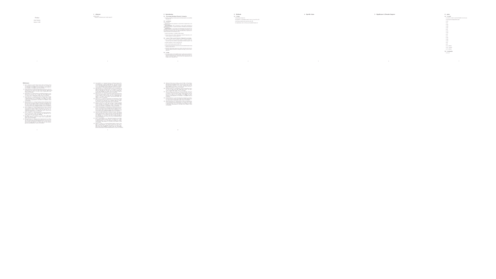

# paper-animator

Animate the progression of your version-controlled paper <3



## Installation

```
pip install paper-animator
```

or from source, with poetry

```
git clone https://github.com/sneakers-the-rat/paper-animator
cd paper-animator
poetry install
```

## Usage

Simplest case, just point it to a .pdf file in some git repository :)

```
paper-animator /some/repo/paper.pdf
```

That method uses the .pdf checked in for each commit in the `main` branch.
If you point it to a .tex file, it will attempt to build it for you! (experimental)

```
paper-animator /some/repo/paper.tex --latex_builder pdflatex
```

Use a repo that's not local! Give the file as a path relative to the root

```angular2html
paper-animator subdirectory/paper.pdf --repo https://github.com/username/example_repo --branch main
```

See `paper-animator --help` for all options -- note that for arguments that are tuples, you must 
pass them individually, eg `paper-animator --grid_shape 6 4` to pass a grid shape of `(6, 4)`

```
$ paper-animator --help
usage: paper-animator [-h] [--output OUTPUT] [--repo REPO] [--branch BRANCH] [--tmp_dir TMP_DIR] [--latex_builder {pdflatex,xetex}] [--frame_duration FRAME_DURATION] [--video_fps VIDEO_FPS]
                      [--resolution RESOLUTION] [--grid_shape GRID_SHAPE] [--dont_cleanup]
                      input

Convert a version controlled paper to a video!

positional arguments:
  input                 Input file, a .pdf or .tex file!

optional arguments:
  -h, --help            show this help message and exit
  --output OUTPUT       Output video file, if absent, input with .mp4 extension, default: None
  --repo REPO           URL to a git repository to clone, if absent, get repo from input file, default: None
  --branch BRANCH       Which branch to use, default: main
  --tmp_dir TMP_DIR     Temporary directory to use, otherwise create one in ~/, default: None
  --latex_builder {pdflatex,xetex}
                        if input is a latex file, which builder to use with latexmk, default: pdflatex
  --frame_duration FRAME_DURATION
                        Duration (in s) to show each commit, default: 1
  --video_fps VIDEO_FPS
                        fps of output video, default: 30
  --resolution RESOLUTION
                        Resolution of plots, default: (1920, 1080)
  --grid_shape GRID_SHAPE
                        Manually override (rows,cols) of figure layout, default: None
  --dont_cleanup        Delete temporary folder after completion
```


# Changelog

## 0.0.2

* Fixing taking tuple-based command line arguments!
* `subdirs` was created in the wrong spot in `animate.plot_img_dirs` !